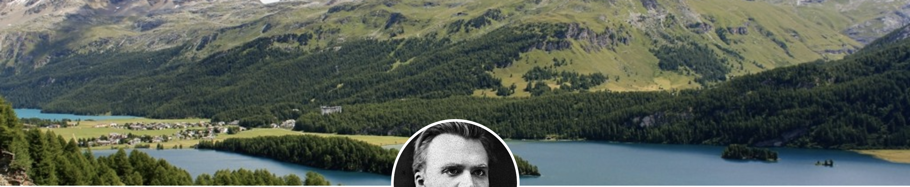
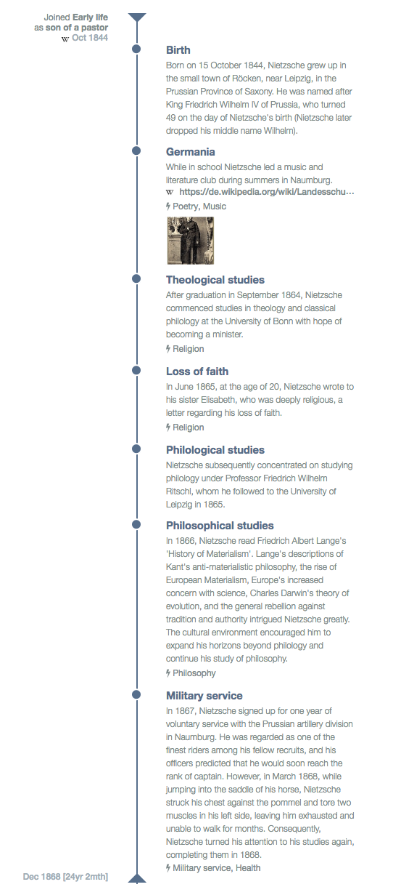
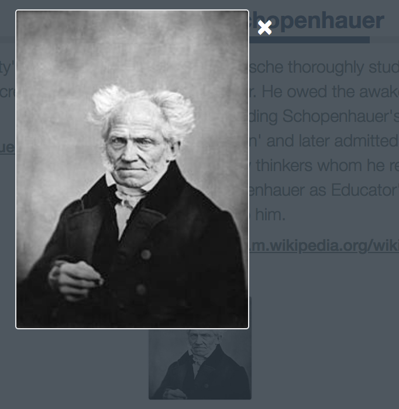
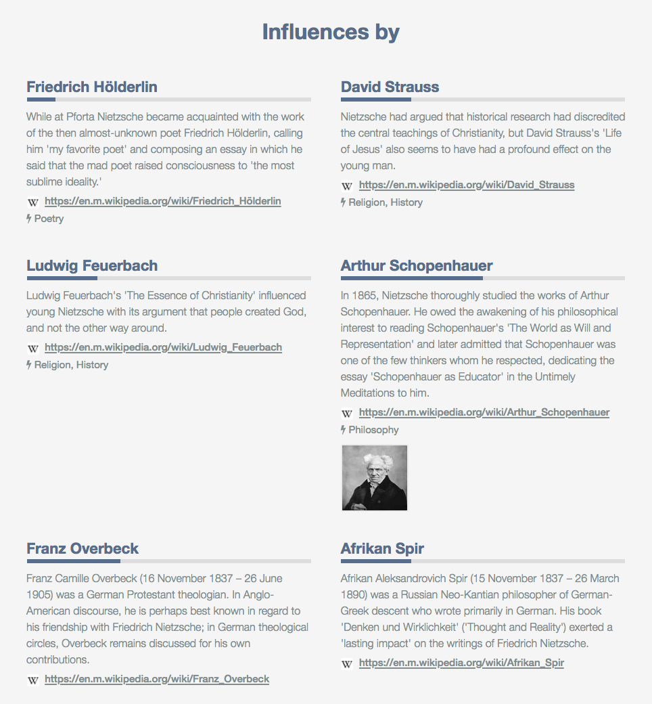
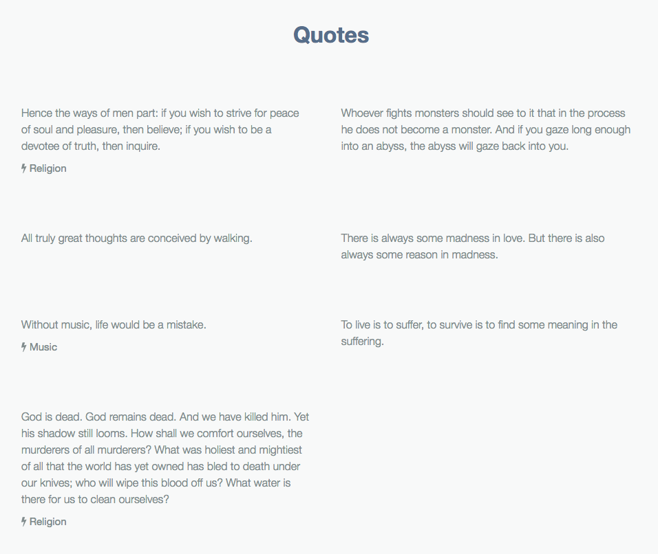
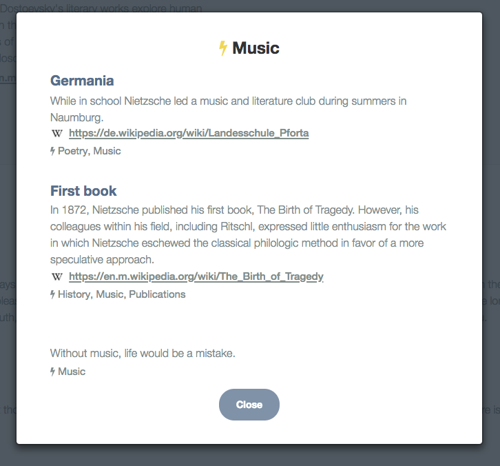

# My Résumé
If you want to give the "story of your life" a little structure, then My Résumé is a tool for you. With My Résumé you can display your résumé (or CV) in a visually appealing way as a mixture of text, graphical elements, images, and links.

Why compose a PDF by hand? Why stick to a Word document for describing the more or less meandering stream of your life?

With My Résumé you can create an "about me" page easily by filling out a JSON template and uploading a couple of files to a web hosting service of your choice.

Here's an example My Résumé for the 19th century philosopher Friedrich Nietzsche: [https://myresume-nietzsche.now.sh](https://myresume-nietzsche.now.sh)

It's a quite long CV. But that's how it is with long and eventful lifes. So for you to get a better view of it, here it is captured in a single image:

## Structure of a My Résumé
A My Résumé is made up of different sections. Some of them are mandatory, some are optional. It's up to you how you use them to present yourself to the world.

### Title
You title your My Résumé with an image across the whole page.

### Personal data
Below the title image you briefly describe yourself.
#### Who are you?
Present yourself with a nice picture of yours and write up a "short bio" in a couple of sentences.

#### Where are you?
Also show off where you can be found on the internet, e.g. LinkedIn, Instagram, Facebook, your homepage etc. Each location will be clickable to take visitors of your My Résumé right to the linked page.

#### Outline of your work history
Since it's about a résumé/CV next comes an overview of all the major phases of your life. Seeing them layed out like this brings some order to the chaos of life😉

#### Your timeline (aka achievements)
Below the overview the details of your work history are listed vertically. Lots of space is needed for all your "achievements" in each phase of your life.

On the left side of the vertical time line the phase descriptions are repeated, on the right side bullet points describe sections within each phase with text, link, tags, and images.

Clicking on a image enlarges it:

### What you are offering (aka classified ads)
Below the details time line you can add "bonus material" grouped into categories. Nietzsche's demo My Résumé contains two such sections:

and

Here again each entry consists of text, link, tags, and images. But you can also use a "progress bar" to add some sort of scale relevant to an entry. For example, in the demo My Résumé the bar beneath each influencer's name is supposed to express the level of influence he/she had on Nietzsche.

### How to get in touch
Finally you can set up a section with a call to action and some information on how to get in touch with you. Include a link to your contact page or your email address:

### Tags
Across achievements in your work history and entries in "classified ads" you can use tags to group information. When clicking on such a tag all pertaining entries are shown in an overlay window:

## Installation
If you're interested in setting up a My Résumé maybe first try to host the demo résumé:

1. Create a demo folder, e.g. `nietzschedemo`.
2. Copy the contents of the `template` folder into your demo folder.
3. Then copy the contents of `demo/Friedrich Nietzsche` into your demo folder. When asked if files should be overwritten answer with yes.

Now you need to "host" the files in the demo folder as a tiny web site. That means either copy them to a folder on your own homepage server or locally start a web server. (If you happen to have Python installed on your computer you can try to run `python -m http.server` in the demo folder. Nietzsche's My Résumé should then be available at `http://localhost:8000`.)

Alternatively use [zeit.co](https://zeit.co/) to host My Résumé files. The Nietzsche demo résumé is there, too. It's free and very easy: just drag&drop or push them using the `now` client.

### Roll your own
If you were successful in installing the demo résumé then you're ready to set up your own My Résumé:

1. Create a folder for your résumé, e.g. `myresume`.
2. Copy the contents of the `template` folder into your résumé folder.
3. Create a sub-folder for your images inside your résumé folder, e.g. `myresume/images`.
4. Enter your data into the `myresume.json` and add any images to the image sub-folder.
5. Host your résumé folder on a web server of your choice.

Editing the `myresume.json` technically is easy - but the devil is in the details. So please have a look a the [JSON reference](doc/jsonref.md) to avoid frustration during set up of your own My Résumé.

---

For the curious: My Résumé's structure was inspired by the CV hosting service [sumry.me](https://sumry.me) which of course is offering a lot more. So don't take My Résumé as a competition but as a starting point to set up a more visually appealing and structured CV online - from which you can grow even more elaborate and serious presentations of yourselfs.

