# myresume.json Reference
A My Résumé is built from two parts:

* a data file with all the descriptive text and links in it; that file is called `myresume.json` and it has to sit next to the `index.html` file.
* any images you'd like to add; it's suggested to put them all in folder (maybe called `myimages`) next to `myresume.json`.

Here's an example for the resulting file/folder structure on your hard disk:

And once you move this file/folder structure to your web server the `index.html` file can be served when you point a browser to it. That's what happens when you open the demo My Résumé at [https://myresume-nietzsche.now.sh](https://myresume-nietzsche.now.sh)

This should be pretty easy - except for the `myresume.json`. My Résumé is free and hence does not sport and fancy tool to enter and edit your data. Instead you need to edit the JSON data in `myresume.json` with a plain text editor like Windows' Notepad or some JSON syntax aware editor like [Sublime](https://www.sublimetext.com) or [VS Code](https://code.visualstudio.com) or with a full fledged JSON editor like [this](https://jsonformatter.org/json-editor):

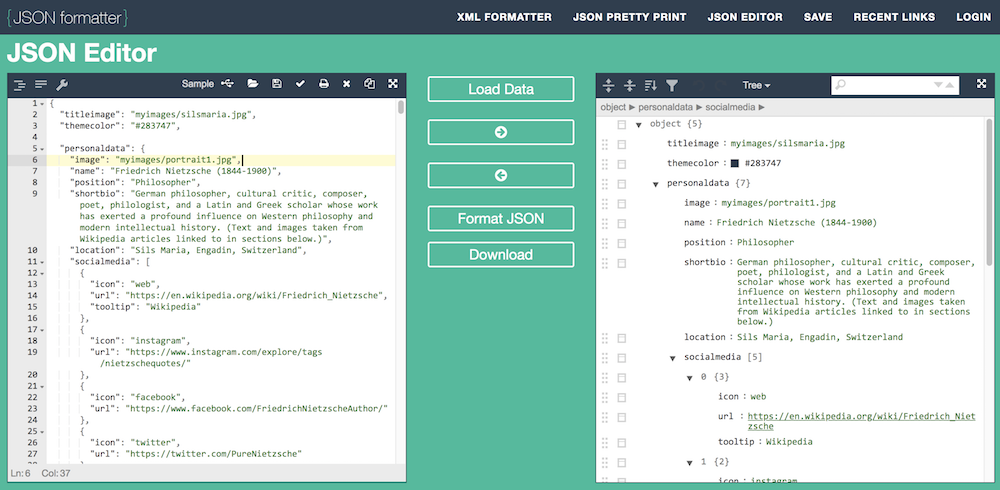

It's up to you. But you have to ensure to stick to the schema described below:

## Schema
### Overall structure
A `myresume.json` consists of three main parts:

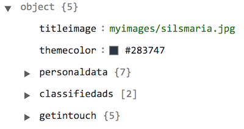

* `personaldata` for, well, your personal data including your work history
* `classifiedads` for whatever you want to "sell" in addition
* `getintouch` for the final "call to action" and a link to a contact page (or your email address)

In addition there is a title image (`titleimage`) you should define to be displayed on top of your personal data. Make it large enough to be strechted nicely across the page, eg. at least 1024 pixels wide.

The title image as all images needs to be referenced from the file/folder structure with a local/relative filename staring from where the `myresume.json` file sits.

The `themecolor` property defines the basic color from which the color for graphic elements in the work history and timeline are derived. You can use color charts like [this](https://www.w3schools.com/colors/colors_names.asp) or [this](https://html-color-codes.info) to find a color that suits you. Just be sure to enter a color value as a hex number with a `#` in front of it. (You can try color names like `Coral`, but numbers let you finetune your color.)

### personaldata
The personal data section again is structured:

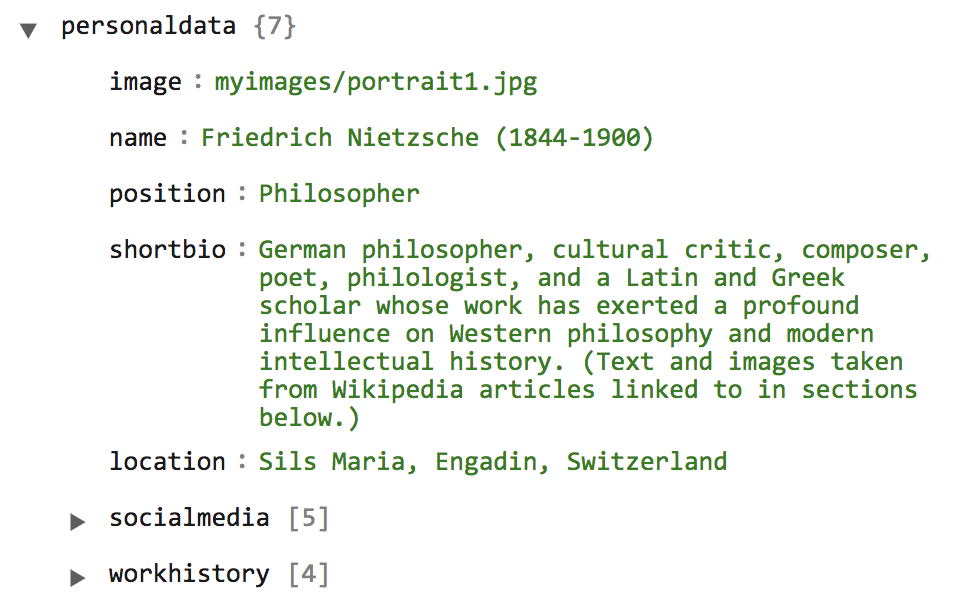

There is data about your person, a list of social media accounts you can be reached at, and all the details of your work history.

#### Personal data
The image you provide will be rendered inside a circle. See to that your face (or whatever you want to display) sits at the center of it.

All other data will be drawn below the image. With the `shortbio` you can briefly describe what you do, what your vision is, or just make a global statement about your person.

You might be tempted to structure such longer texts with line breaks using `\n`. At this point, though, this does not work. Line breaks won't show up in the rendered page.

The `location` will be displayed below the social media section. When clicked Google Maps will be opened in a new browser tab on the location matching the property's value.

#### socialmedia
In the social media section you can configure where you're present on the internet and how you can be reached. Each "channel" will be shown with a small icon to click on:

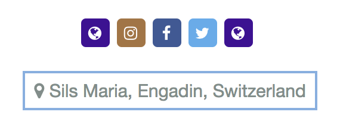

The main information for each social medium is the `url` of your profile there and which `icon` to use. Optionally you can add a `tooltip` to show while hovering the mouse over the icon. If no tooltip is given the icon name is shown.

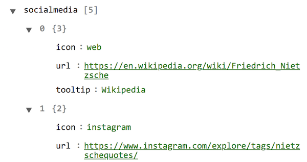

The following values for `icon` are supported:

* `email` -- prefix your email address with `mailto:`
* `facebook`
* `github`
* `instagram`
* `linkedin`
* `twitter`
* `web` -- use for any other social media
* `xing`

#### workhistory
Your work history is the history of the major phases in your (working) life. It is first displayed as an overview across the page in chronological order.

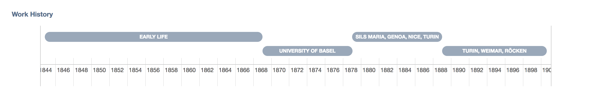

If phases should overlap they are stacked vertically. And in case the description of a phase does not fit in the "bubble" it is fully displayed when clicking the "bubble".

The following data can be specified for each work history entry:

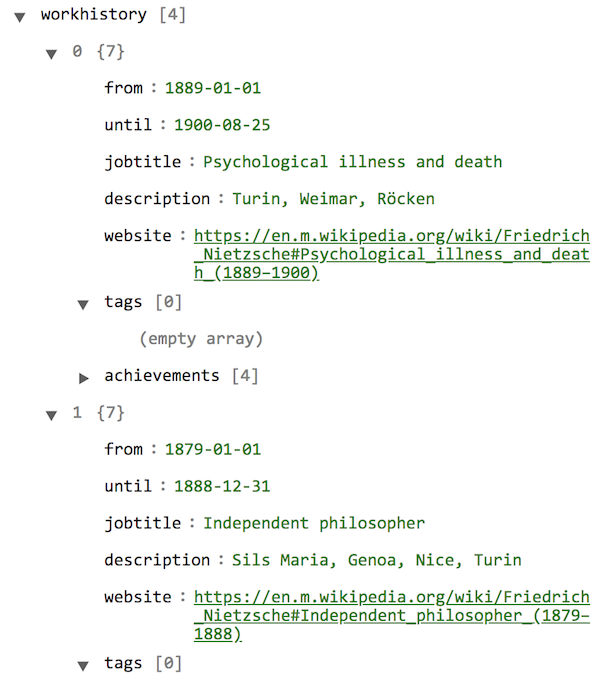

* `from`and `until` define the period over which this phase extends. Please observe the date format: yyyy "-" mm "-" dd.
* The `description` is shown in the "bubble" of the diagram.

All other data are only used in the detailed work history below the overview:

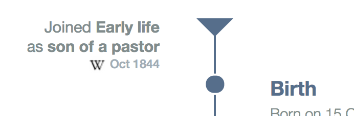

and

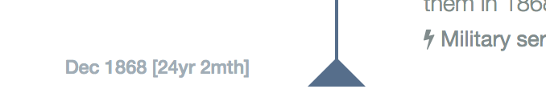

As you can see `from` and `until` are at the opening and closing bracket (triangle). The `website` is underlying the `from` label as is testified by the favicon. `jobtitle` and `description` are joined in the phrase "Joined {description} as {jobtitle}".

Tags can be used with several entry types: work history items, achievements, classified ads. They are a comma separated list of strings, e.g. `"Writing", "Philosophy"` and will be displayed beneath their entry. When clicked all entries with the same tag are displayed in an overlay window.

Work history items are displayed from left to right in the horizontal timeline overview according to their date ranges.

##### achievements
In the vertical, detailed work history the entries are displayed from top to bottom in the order they appear in the `myresume.json` file! That's because maybe you want to list your phases from earlier to later (like in the demo My Résumé) or from current to oldest. You decide.

In the detailed work history you can, well, go into detail about each phase in your life. Add any number of "achievements" to be listed from top to bottom in the order they appear in the list:

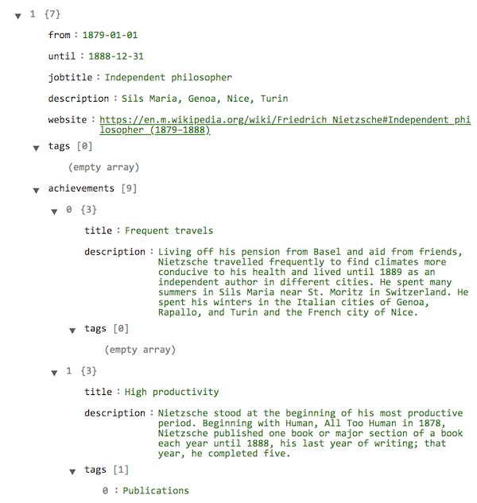

The work history entry appears on the left of the vertical timeline, the achievements on the right:

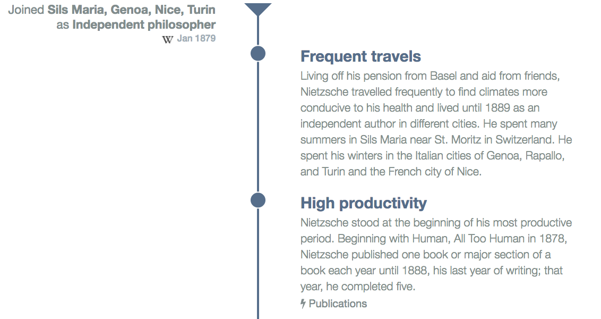

Achievements have the following properties:

* `title`
* `description`
* `images` -- a list of filenames for images to display below an entry; images are displayed as square thumbnails to click on to enlarge.
* `url` -- a link to a web page
* `tags`

A full blown achievement:

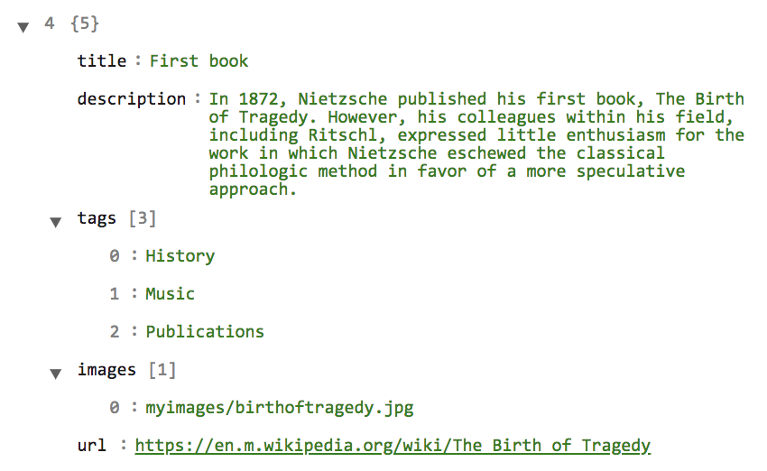

And in the browser:

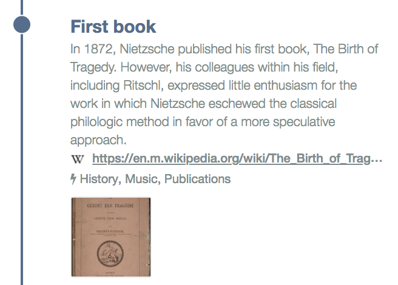

### classifiedads
"Classified ads" are additional info nuggets outside your work history timeline. You group them into as many sections as you like below the detailed work history.

Each section is headed with a `caption`and a `backgroundcolor` to set them visibly apart from each other:

Nested inside the `classifiedads` JSON property then is a list of `ads`. Ads sport the same properties as achievements - plus a `progress` value. The progress (given as a integer percentage from 0..100) allows you to use classified ads to show of your capabilities and knowledge - which by be developed to different degrees (eg. from novice to expert).

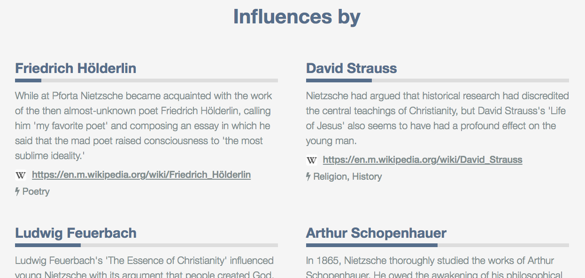

The demo My Résumé the `progress` is used to suggest the degree of influence a person had on Nietzsche.

### getintouch
Finally, the section for your contact info is the most simple and shortest one:

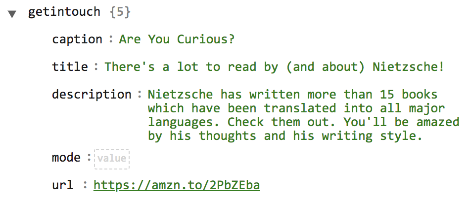

Check out how this renders:

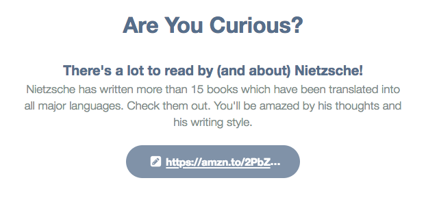

There is a section headline (`caption`), a sub-headline or call to action (`title`), and a description to elaborate on what the benefits are of clicking the button - which opens the page given by the `url`.

If you enter `email` as the value for `mode`, then the `url` is prefixed with `mailto:` and the email client of the user will open upon button click. Any other `mode` value will lead to the `url` being interpreted as a link to a web page which will be opened in another browser tab.

